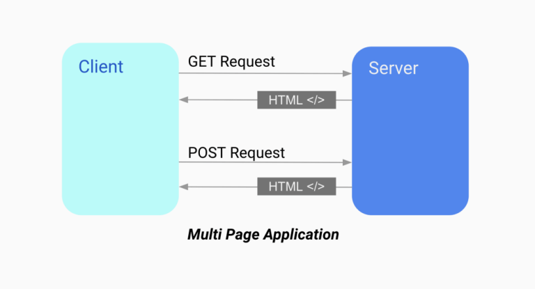
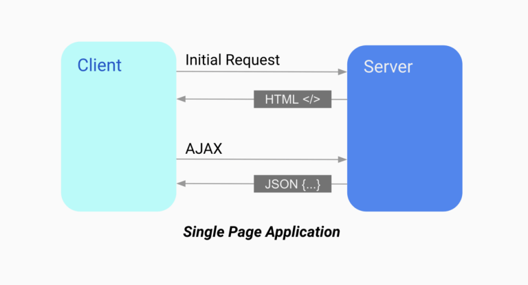
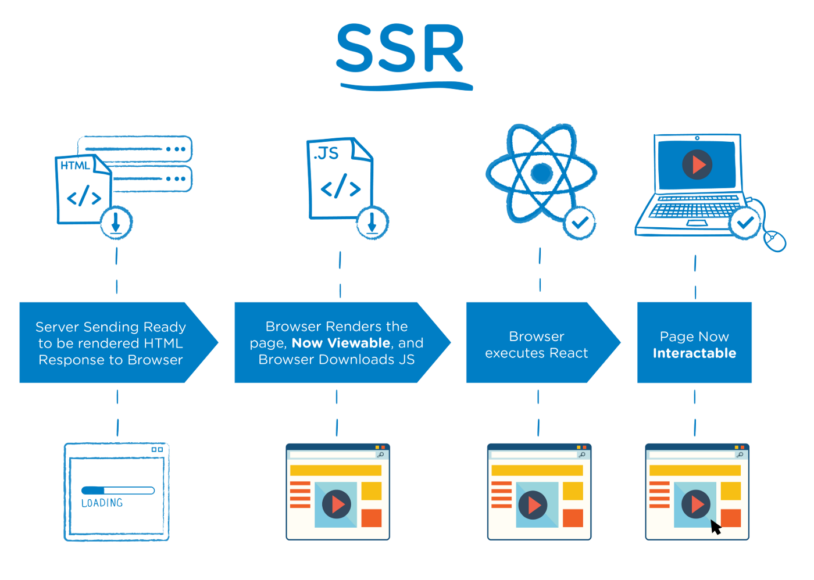
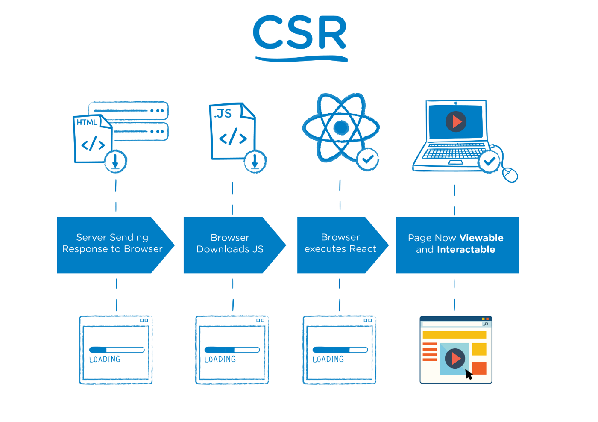

# 💡 CSR? SSR?

> 멀티 ? 싱글 ?

싱글 페이지 어플리케이션? SPA🤔 🤔 🤔

멀티 페이지 어플리케이션? MPA🤔 🤔 🤔

 

> 서버 ? 클라이언트 ?

SSR (Server Side Rendering)? 🤔 🤔 🤔

CSR (Client Side Rendering)? 🤔 🤔 🤔

 

멀티 페이지 어플리케이션 → SSR (Server Side Rendering) 방식 지원 👀

싱글 페이지 어플리케이션 → CSR (Client Side Rendering) 방식 지원 👀

 

**싱글 페이지 어플리케이션에서 `SSR 방식`을 지원한다.**
**싱글 페이지 어플리케이션에서 `CSR 방식`을 지원한다.**

## 멀티 페이지 어플리케이션 MPA

> 정의

- 여러개로 정의된 페이지

 

> 동작 방식

- 클라이언트가 새로운 페이지를 요청할 때마다 서버는 새로운 리소스를 제공한다.

 

 

> 특징

- 새로운 페이지를 요청할 때마다 서버에서 렌더링된 정적 리소스(HTML, CSS, JavaScript)가 다운로드된다.
- 페이지 이동하거나 새로고침하면 전체 페이지를 다시 렌더링한다.

 

## 싱글 페이지 어플리케이션 SPA

> 정의

- 단일 페이지

 

> 동작 방식

- 클라이언트가 새로운 페이지를 요청할 경우 딱 한 페이지만 불러온다 이후의 요청 사항에 대한 내용은 기존 페이지의 내부를 수정해서 보여준다.
- SPA는 웹 에플리케이션에 필요한 모든 리소스를 최초 한 번에 다운로드한다

 

 

> 특징

- 단 한 번만 리소스(HTML, CSS, JavaScript)를 로딩한다.
- 최초 페이지를 로딩한 시점부터는 페이지 리로딩 없이 필요한 부분만 서버로 부터 받아서 화면을 갱신하는 것이다.

 

# SSR VS CSR

 

- 멀티 페이지 어플리케이션 → SSR (Server Side Rendering) 방식 지원 👀

 

- 싱글 페이지 어플리케이션 → CSR (Client Side Rendering) 방식 지원 👀

## 장 단점으로 알아보는 MPA & SPA

## `MPA 장점`

1. 검색엔진 최적화에 유리하다.
2. 첫 로딩 시간이 매우 짧다.

 

## `MPA 단점`

1. 새로운 페이지를 이동하면 `“깜빡"`이는 현상이 발생한다 (`UX 저하`)
2. 페이지 이동시 불 필요한 템플릿도 중복해서 로딩 (성능 저하)
3. 서버 렌더링에 따른 부하 (성능 저하)

 

## `SPA 장점`

1. 새로운 페이지를 이동하면 깜빡이는 현상이 발생하지 않는다 (`UX 향상`)
2. 페이지 이동시 불 필요한 템플릿을 중복해서 로딩하지 않는다 (성능 향상).
3. 서버 렌더링에 따른 부하가 일어나지 않는다. (성능 향상).

## `SPA 단점`

1. 검색엔진 최적화에 불리하다 (인덱싱 불가)
2. 첫 로딩 시간이 길다.

 

# 단점 보완

## 검색엔진 최적화에 불리하다

<aside>
💡 React - Next_js → SSR방식 지원

</aside>

## 첫 로딩 시간이 길다.

<aside>
💡 React - Next_js → 코드 스플라이팅 지원

</aside>

 

## 🔗 Reference

- [https://ko.wikipedia.org/wiki/리액트*(웹*프레임워크)#:~:text=리액](<https://ko.wikipedia.org/wiki/%EB%A6%AC%EC%95%A1%ED%8A%B8_(%EC%9B%B9_%ED%94%84%EB%A0%88%EC%9E%84%EC%9B%8C%ED%81%AC)#:~:text=%EB%A6%AC%EC%95%A1%ED%8A%B8>)
- [https://hanamon.kr/spa-mpa-ssr-csr-장단점-뜻정리/](https://hanamon.kr/spa-mpa-ssr-csr-%EC%9E%A5%EB%8B%A8%EC%A0%90-%EB%9C%BB%EC%A0%95%EB%A6%AC/)
- [https://medium.com/@msj9121/next-js-제대로-알고-쓰자-8727f76614c9](https://medium.com/@msj9121/next-js-%EC%A0%9C%EB%8C%80%EB%A1%9C-%EC%95%8C%EA%B3%A0-%EC%93%B0%EC%9E%90-8727f76614c9)
- [https://johngrib.github.io/wiki/dry-principle/](https://johngrib.github.io/wiki/dry-principle/)
