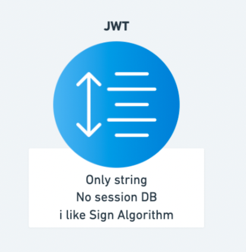
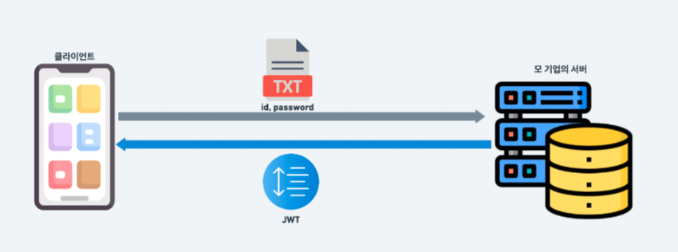
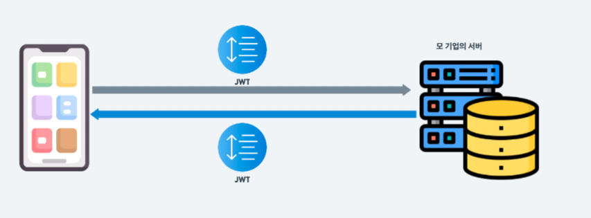

# 💡Session & JWT

> **_`Session이란 무엇인가?`_**

**세션**은 방문자의 요청에 따른 정보를 방문자 메모리에 저장하는 것이 아닌 웹 서버에 저장하고 서버에서 생성된 식별자 ID로 방문자의 정보를 관리하는 것을 말한다.
이때 생성된 식별자 ID는 쿠키를 통해서 전달된다.
사용자의 민감한 정보를 Session DB라는 곳에 저장함으로써 개인 정보를 안전하게 지킬 수 있고 세션에 이미 로그인 정보가 저장되어 있기 때문에 화면 이동 시에 로그인이 불필요 하여 중복 로그인을 방지할 수 있습니다.

 

> **_`JWT이란 무엇인가?`_**

1. Json Web Token의 약자로 json 포맷을 이용하여 사용자의 정보를 안전하게 전달하는 방식이다.
2. JWT를 사용하면 Session DB없이 사용자를 검증할 수 있다.
3. JWT는 주로 모바일이나 웹의 사용자 인증을 위해 사용한다.

 

> JWT의 장점

1. No Session : 세션이 없기 때문에 기존 세션이 가졌던 단점이 해결된다 (모든 요청에 대한 DB탐색, 세션DB의 용량 처리 문제)
2. 공간 제약이 있는 쿠키와 달리 jwt는 제약이 없다.

> 세션은 언제사용하고 토큰은 언제사용할까?

- **_`세션`_**

세션을 사용하면 유저의 정보를 저장한다. 이를 토대로 다양한 서비스를 제공할 수 있다. 많은 서비스를 제공하는 대기업에서 사용한다.

1. 특정유저의 로그인을 제한할 때
2. 구글, 네이버, 인스타그램에서 제공하는 로그인 된 디바이스 삭제 기능
3. 넷플릭스,디즈니 플러스 처럼 계정 공유의 숫자를 제한

- **_`JWT`_**

JWT를 사용하면 생성된 토큰을 추적하지 않는다. 서버가 아는 것은 토큰이 유효한가 아닌가 여부일 뿐이다. 그렇기 때문에 세션의 기능을 사용할 수 없다. 그렇기에 세션이나 DB없이 유저를 인증하는데 유용하다.

1. QR체크인

 

> **_쿠키? 토큰? JWT? 한줄요약_**

`쿠키` : 클라이언트와 서버사이에서 데이터를 주고 받는 역할을 도와주는 시스템 매개체다

`토큰` : 토큰이란 문법적인 의미를 가지며, 문법적으로 더 이상 나눌 수 없는 코드를 의미한다. 즉, 서버가 기억하는 이상하게 생긴 텍스트이다

`JWT`: 정보를 갖고있는 토큰이다 DB없이 사용자를 검증할 수 있다

 

> 쿠키와 세션의 차이점은 무엇인가?

`쿠키 :` **쿠키**의 경우는 방문자의 정보를 방문자 컴퓨터의 메모리에 저장하는 것을 말한다주로 방문한 사이트의 정보를 저장하는데에 사용한다.

`세션 :` **세션**은 방문자의 요청에 따른 정보를 방문자 메모리에 저장하는 것이 아닌 세션DB를 통해 세션 아이디를 생성하여 방문자의 정보를 관리하는 것을 말한다.

# 🚀설명

> **_네이티브 앱의 로그인 정보 저장방식은 무엇인가?_**

브라우저에서 로그인 정보를 보내고 허가를 받기 위해서는 쿠키를 사용했다. 쿠키에 담긴 정보를 세션 ID에 저장하고 세션은 고유한 세션 ID를 사용자의 쿠키에 담아 보내면서 이후에 방문시 사용자를 인증하는 수단으로 사용했다.
하지만 네이티브 앱에서는 쿠키가 존재하지 않는다. 그렇다면 네이티브 앱은 어떻게 동작하는가?

- **_`토큰`_**

네이티브 앱에서는 웹과 달리 쿠키를 사용하지 않는다. 대신 `토큰`을 사용한다. 토큰은 핸드폰 앱을 이용할 때는 서버에 토큰을 보낸다. 토큰안에는 string 문자열이 들어가있다. `토큰이란` 문법적인 의미를 가지며, 문법적으로 더 이상 나눌 수 없는 코드를 의미한다.

- **_`세션DB`_**

앱의 서버에서는 사용자의 토큰 정보를 보고선 `세션 DB`로 부터 사용자를 식별할 수 있는 고유의 세션ID를 만들어서 사용자에게 돌려준다. 토큰이라는 매게체를 사용하여 네이티브 앱에서도 사용자를 인증할 수 있게 되었다.

- **_`세션 DB의 특징`_**

세션은 로그인한 유저들의 모든 세션 ID를 DB에 저장해야한다. 클라이언트가 무언가를 요청하고 응답받는 과정중에서의 세션DB의 동작은 아래와 같다.

1. 서버는 요청이 들어올 때마다 세션 ID를 보고 세션ID와 일치하는 유저를 찾는다.
2. 인증된 유저인 것을 서버가 파악하면 요청에 대한 응답을 해준다.

- **_`세션 DB의 단점`_**

1. 요청이 들어올 때마다 DB를 찾아야한다.
2. 유저가 늘어나면 늘어날수록 세션DB의 용량또한 커져야한다.

> **JWT의 등장**

JWT는 토큰 형식의 파일이다. JWT로 유저 인증을 처리하면 세션 DB가 필요없다. 즉, 세션 DB의 단점들이 사라진 것이다.

- `*동작방식*`

User A가 로그인을 하기 위해서는 유저명과, 비밀번호를 서버에 보낸다. 서버는 사용자의 토큰을 보고선 유저의 ID를 보고선 사인 알고리즘 방식으로 사인을 한다 (데이터를 가공한다.) 그리고 사인된 정보를 String 형태로 저장한 후에 요청에 대한 응답을 한다.

이제 사용자는 웹 사이트를 돌아다닐 때 사인된 정보가 담긴 토큰을 서버에 보낸다. 서버는 토큰을 받으면 해당 사인이 유효한지 체크한다. 토큰이 유효하다면 서버는 User A를 유저로 인증한다.

- JWT의 장점

1. No Session : 세션이 없기 때문에 기존 세션이 가졌던 단점이 해결된다 (모든 요청에 대한 DB탐색, 세션DB의 용량 처리 문제)
2. 공간 제약이 있는 쿠키와 달리 jwt는 제약이 없다.

> **_세션은 언제사용하고 토큰은 언제사용할까?_**

- **_`세션`_**

세션을 사용하면 유저의 정보를 저장한다. 이를 토대로 다양한 서비스를 제공할 수 있다. 많은 서비스를 제공하는 대기업에서 사용한다.

1. 특정유저의 로그인을 제한할 때
2. 구글, 네이버, 인스타그램에서 제공하는 로그인 된 디바이스 삭제 기능
3. 넷플릭스,디즈니 플러스 처럼 계정 공유의 숫자를 제한

- **_`JWT`_**

JWT를 사용하면 생성된 토큰을 추적하지 않는다. 서버가 아는 것은 토큰이 유효한가 아닌가 여부일 뿐이다. 그렇기 때문에 세션의 기능을 사용할 수 없다. 그렇기에 세션이나 DB없이 유저를 인증하는데 유용하다.

1. QR체크인

 

> **_쿠키? 토큰? JWT? 한줄요약_**

`쿠키` : 클라이언트와 서버사이에서 데이터를 주고 받는 역할을 도와주는 시스템 매개체다

`토큰` : 토큰이란 문법적인 의미를 가지며, 문법적으로 더 이상 나눌 수 없는 코드를 의미한다. 즉, 서버가 기억하는 이상하게 생긴 텍스트이다

`JWT`: 정보를 갖고있는 토큰이다 DB없이 사용자를 검증할 수 있다

 

> 쿠키와 세션의 차이점은 무엇인가?

`쿠키 :` **쿠키**의 경우는 방문자의 정보를 방문자 컴퓨터의 메모리에 저장하는 것을 말한다주로 방문한 사이트의 정보를 저장하는데에 사용한다.

`세션 :` **세션**은 방문자의 요청에 따른 정보를 방문자 메모리에 저장하는 것이 아닌 세션DB를 통해 세션 아이디를 생성하여 방문자의 정보를 관리하는 것을 말한다.

# 🔗  Reference

- [https://88240.tistory.com/190](https://88240.tistory.com/190)
- [https://www.youtube.com/watch?v=tosLBcAX1vk](https://www.youtube.com/watch?v=tosLBcAX1vk)
