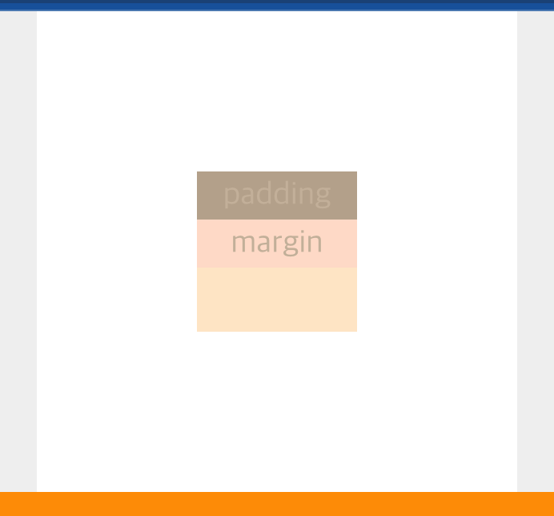

# 💡중앙정렬



- HTML

```css
<div class="pg-container">
	<div class="pg-wrapper">
	  <div class="pg-item">padding</div>
	  <div class="pg-item">margin</div>
	</div>
</div>
```

- CSS

```css
.pg-container {
  width: 300px;
  height: 300px;
  background-color: #fff;
  margin: 0 auto;
  display: flex;
  justify-content: center;
  align-items: center;
}
.pg-wrapper {
  width: 100px;
  height: 100px;
  background-color: bisque;
}
.pg-item:nth-child(1) {
  background-color: black;
  opacity: 0.3;
  text-align: center;
  height: 30px;
  line-height: 30px;
}
.pg-item:nth-child(2) {
  background-color: pink;
  opacity: 0.3;
  text-align: center;
  height: 30px;
  line-height: 30px;
}
```

> Element Node 중앙 정렬

- `display`

```css
display: flex
justify-content:center
align-item:center
```

부모 Element에 flex 속성을 주고 중앙 정렬

- `margin`

```css
margin: 0 auto;
```

중앙 정렬할려는 Element에 margin 0 auto 속성 적용

> Content Node 중앙 정렬

```css
text-align: center; /* 수평정렬 */
height: 30px; /* 수직정렬 */
line-height: 30px; /* 수직정렬 */
```

Content노드와 ling-height값 일치시키기
