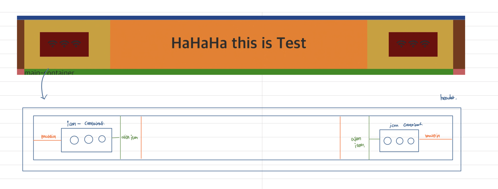

```html
<body>
  <div id="app">
    <header id="header">
      <div class="nav-container">
        <div class="leftmenu-wrapper left-margin">
          <div class="icon-container padding">
            <i class="fas fa-wifi icon"></i>
            <i class="fas fa-wifi icon"></i>
            <i class="fas fa-wifi icon"></i>
          </div>
        </div>
        <div class="logo-wrapper">
          <h1>HaHaHa this is Test</h1>
        </div>
        <div class="rightmenu-wrapper right-margin">
          <div class="icon-container padding">
            <i class="fas fa-wifi icon"></i>
            <i class="fas fa-wifi icon"></i>
            <i class="fas fa-wifi icon"></i>
          </div>
        </div>
      </div>
    </header>
  </div>
</body>
```

> HTML structure

App : App의 필드

header: header의 레이아웃

container: header 내부의 요소들 grid 스타일링, grid-item 요소들 정렬

wrapper: wrapper 내부의 요소들 flex 스타일링, flee-item 요소들 정렬

> CSS structure

- Layout

```css
#header {
  width: 100%;
  height: 100px;
  position: sticky;
  top: 0;
}
```

postion을 sticky로 정함으로써 float처럼 붕 떠있는 요소가 되는것이 아닌 일정한 relative한 값을 가지고 있음 이로 인해서 아래 있는 main 요소의 사진이 위까지 넘쳐 올라오는것을 막아줄 수 있음.

- Container

```css
.nav-container {
  width: 100%;
  height: 100%;
  display: grid;
  grid-template-columns: 1fr 3fr 1fr;
  grid-template-areas: 'left-menu center-logo right-menu';
}
```

grid를 통한 wrapper 요소들의 column 지정

- Wrapper

```css
.leftmenu-wrapper {
  grid-area: left-menu;
  display: flex;
  align-items: center;
}

.logo-wrapper {
  grid-area: center-logo;
  display: flex;
  justify-content: center;
  align-items: center;
}

.rightmenu-wrapper {
  grid-area: right-menu;
  display: flex;
  justify-content: flex-end;
  align-items: center;
}
```

grid aria를 통한 위치 설정을 해주었다. 안해줘도 구조는 무너지지 않는다. 구분짓기 위해서 grid-area 지정
wrapper에는 페이지에 나타나는 요소들을 정렬하기 위함 flex를 통한 요소들의 위치 정렬

- View Element

```css
.icon-container {
  width: 100px;
  height: 50px;
  display: flex;
  justify-content: space-between;
}
```

icon요소를 나타내기 위한 container 이외의 요소들은 직접 width, height를 정하여 위치 조정

> padding & margin. css파일 생성

```css
.left-margin {
  margin-left: 2rem;
}

.right-margin {
  margin-right: 2rem;
}

.padding {
  padding: 1rem;
}
```

공통된 padding 및 margin을 적용하기 위해서 파일을 따로 옮겨서 관리하기로했다. 아직 padding margin font-size, color 등등의 요소들의 컴포넌트를 만들어서 관리하는 방법을 알지 못한다. 이번에 이렇게 분리를 해두는 연습을 하면서 나중에는 요소들의 특징을 잘 구분지어 유지보수가 쉽도록 해야겠다.
