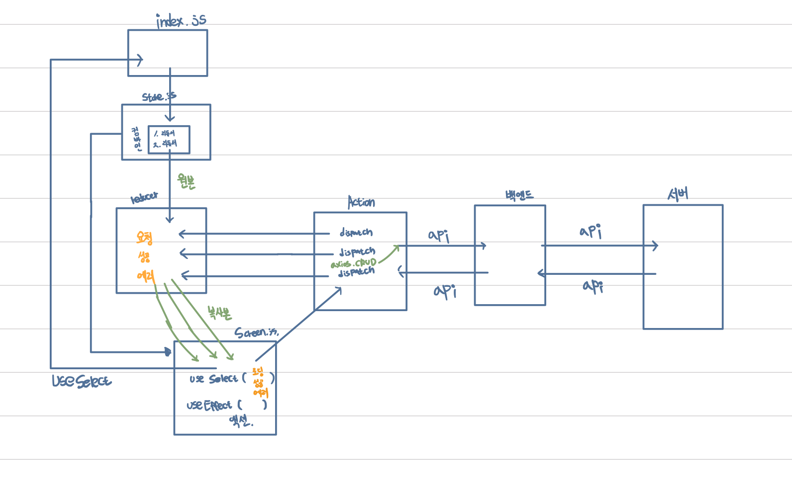

# 💡Redux

> 리덕스를 왜 사용하는걸까?

리액트를 사용하면서, 상태 관리를 하는 것은 매우 중요한 요소 중 하나이다. 리액트로 만들 수 있는 단일 페이지 애플리케이션(SPA, Single Page Application)는 data 혹은 UI의 변화가 복잡, 다양해지는 경우가 많아진다. 그에 따라 단일 페이지를 이루는 컴포넌트들의 데이터 교류 또한 복잡해지기 때문에 이를 효율적으로 관리할 방법이 필요하다. 리덕스는 이러한 복잡한 상태 관리를 효율적으로 할 수 있게 도와주는 도구이다.

<br/>

# 🚀 보일러플레이트

**'묻지도 따지지도 않고 따라 적는 코드'** 를 우리는 **보일러 플레이트(Boiler Plate) 코드** 라고 한다. 이 용어는 미국 신문 업계 초창기에 매일 바뀌지 않고 동일한 내용(신문의 제목, 형태 등 변하지 않는 부분)을 효율적으로 출력하기 위해 **'박아 놓고 똑같이 사용하기 위해' 작성된 철판 모형**을 의미한다. 이런 용어가 프로그래밍으로 넘어와서 **'별 수정 없이 반복적으로 사용되는 코드'**를 보일러 플레이트라고 한다.

<br/>



<br/>

## 내가 이해한 리덕스 보일러 플레이트 환경

> `Screen Component`

useEffect 안에 Action함수를 넣어준다. useEffect는 콜백으로 전달한 두번째 인수에 변화가 생길 경우 변경된 부분만 react-dom에 의하여 변경이 된 부분이 재렌더링 된다. Screen.js에서는 변경된 상태값을 Action 컴포넌트로 이동시킨다

<br/>

> `Action Component`

액션컴포넌트가 실행이되면 리덕스 미들웨어 라이브러리인 redux-thunk 를 통해 dispatch를 비동기 함수로 동작시킨다. 이때 dispatch에는 reducer 컴포넌트에 3가지 action.type을 전달한다.

- 요청

```jsx
dispatch({ type: PRODUCT_LIST_REQUEST });
```

요청에서는 해당 타입에 맞는 reducer를 호출하여 화면에 loading중 인 상태를 나타낸다.

- 응답

```jsx
const { data } = await axios.get("/api/products");
dispatch({
  type: PRODUCT_LIST_SUCCESS,
  payload: data,
});
```

응답을 보내기전에 axios를 통해서 백엔드에 CRUD로 데이터를 요청한다. 이때 백엔드는 서버를 통해서 데이터를 얻어오고 구해진 데이터를 다시 프론트 서버인 액션 컴포넌트에 전달이된다. 이 과정에서 백엔드에서의 데이터 정보를 찾아왔으면 액션의 타입은 success인 상태와 payload를 통하여 데이터를 전달한다.

- 실패

```jsx
dispatch({
  type: PRODUCT_LIST_FAIL,
  payload:
    error.response && error.response.data.message
      ? error.response.data.message
      : error.message,
});
```

만약 프론트엔드 서버가 백엔드에서 데이터를 불러오는데 성공할 경우에는 에러처리를 FAIL 값을 type으로 보내며 그에 대한 payload로는 에러메세지를 보낸다.

이 일련의 과정은 try...catch...문을 통해서 에러핸들링이 진행된다.

<br/>

> `Reducer component`

reducer 컴포넌트는 반드시 state값을 반환 해야 한다.

action 컴포넌트를 통해서 전달받은 dispatch를 통해서 productReducer의 state값에 정보를 저장한다. 이때 상태값으로 반환하는 값은 loading, product, error 총 3가지가 있다.

```jsx
export const productListReducer = (state = { products: [] }, action) => {
  switch (action.type) {
    case PRODUCT_LIST_REQUEST:
      return { loading: true, products: [] };
    case PRODUCT_LIST_SUCCESS:
      return { loading: false, products: action.payload };
    case PRODUCT_LIST_FAIL:
      return { loading: false, error: action.payload };
    default:
      return state;
  }
};
```

<br/>

> `다시 Screen component`

```jsx
const HomeScreen = () => {

  const productList = useSelector(state => state.productList);
  const { loading, error, products } = productList;

  useEffect(() => {
    dispatch(listProducts());
  }, [dispatch]);

  return (
		...
)
```

useSelector를 통해서 Reducer에 저장된 State값에 접근한다. loading, error, products의 값을 구조분해 할당 받은 후에 아래와 같이 할당된 변수를 사용한다.

```jsx
return (
  <>
    <h1>Latest Products</h1>
    {loading ? (
      <Loader />
    ) : error ? (
      <Message variant="danger">{error}</Message>
    ) : (
      <Row>
        {products.map(product => (
          <Col key={product._id} sm={12} md={6} lg={4} xl={3}>
            <Product product={product} />
          </Col>
        ))}
      </Row>
    )}
  </>
);
```

삼항연산자를 통해서 loading 중 일때는 화면에 로딩중임을 나타내는 Loader 컴포넌트를 보여주고 에러가 발생할 경우에는 error 컴포넌트를 호출한다. 마지막으로 데이터 바인딩에 성공했다면 백엔드에서 데이터를 받아온 값이 data에 담긴 후 reducer에 저장될 타이밍에 product에 담긴 값들을 보여준다.

<br/>

정리가 더 필요한 부분이다.

리덕스에 대한 상태관리는 앞으로 추가적으로 정리하며 이해해 나갈 예정이다.

# 🔗 Reference

- [https://coding-grandpa.tistory.com/entry/보일러-플레이트-이해하기](https://coding-grandpa.tistory.com/entry/%EB%B3%B4%EC%9D%BC%EB%9F%AC-%ED%94%8C%EB%A0%88%EC%9D%B4%ED%8A%B8-%EC%9D%B4%ED%95%B4%ED%95%98%EA%B8%B0)
- [https://velog.io/@youthfulhps/What-is-Redux-and-why-use-it](https://velog.io/@youthfulhps/What-is-Redux-and-why-use-it)
