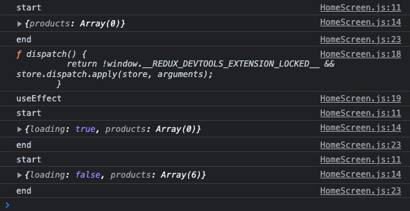

# 💡Redux with useEffect

# 🚀 Code

<br/>

> useEffect를 통한 보일러 플레이트 동작방식 이해하기.

```jsx
const HomeScreen = () => {
  console.log("start");
  const dispatch = useDispatch();
  const productList = useSelector(state => state.productList);
  console.log(productList);
  const { loading, error, products } = productList;

  useEffect(() => {
    console.log(dispatch);
    console.log("useEffect");
    dispatch(listProducts());
  }, [dispatch]);

  console.log("end");
  return (
	 .......
  );
};
```

- 해당 코드를 찍었을 때 나오는 console.log



천천히 분석해보자.

나는 이 과정을 소스코드 평가 과정 그리고 실제 런타임 환경인 소스코드 실행 과정으로 구분지어 이해해 보려고한다.

<br/>

- `소스코드 평가과정` 🚀

```jsx
const HomeScreen = () => {
  console.log("start"); // 🚀 함수 호이스팅
  const dispatch = useDispatch(); // 🚀 undefined
  const productList = useSelector(state => state.productList); // 🚀 undefined
  console.log(productList); // 🚀 함수 호이스팅
  const { loading, error, products } = productList; // 🚀 undefined

  useEffect(() => {
    console.log(dispatch);
    console.log("useEffect");
    dispatch(listProducts());
  }, [dispatch]);

// 🚀 함수 호이스팅

  console.log("end"); // 🚀 함수 호이스팅
  return (
	 .......
  );
};
```

<br/>

- `소스코드 실행과정` 📦  초기화 및 함수 호출

```jsx
const HomeScreen = () => {
  console.log("start"); // 📦 "start" 출력
  const dispatch = useDispatch(); //📦 useDispatch return값으로 초기화
  const productList = useSelector(state => state.productList);
//📦 useSelector return값으로 초기화
  console.log(productList); // 📦 "productList" 출력
  const { loading, error, products } = productList; // 구조 분해 초기화

  useEffect(() => {
    console.log(dispatch);
    console.log("useEffect");
    dispatch(listProducts());
  }, [dispatch]); // 변화가 없으므로 아무런 출력을 하지 않는다.

  console.log("end"); //  📦 "productList" 출력
  return (
	 .......
  );
};
```

<br/>

> Action

메서드는 콜백의 두번째 인수로 넘겨준 배열의 값에 변화가 있을 경우에 함수를 호출한다. listProducts 함수를 호출한다 dispatch를 통해서 액션의 기능을 수행하는 lisrProducts 컴포넌트로 이동한다

```jsx
export const listProducts = () => async dispatch => {
  try {
    dispatch({ type: PRODUCT_LIST_REQUEST });

    const { data } = await axios.get("/api/products");

    dispatch({
      type: PRODUCT_LIST_SUCCESS,
      payload: data,
    });
  } catch (error) {
    dispatch({
      type: PRODUCT_LIST_FAIL,
      payload:
        error.response && error.response.data.message
          ? error.response.data.message
          : error.message,
    });
  }
};
```

이떄 listProducts 내부의 로직을 보면 dispatch를 통해서 두번의 비동기 함수를 호출한다. 그에 따라서 reducer에 있는 PRODUCT_LIST_REQUEST, PRODUCT_LIST_SUCCESS, PRODUCT_LIST_FAIL 즉, 요청, 성공, 실패에 관한 type을 명시해서 보낸다.

<br/>

> Reducer

```jsx
export const productListReducer = (state = { products: [] }, action) => {
  switch (action.type) {
    case PRODUCT_LIST_REQUEST:
      return { loading: true, products: [] };
    case PRODUCT_LIST_SUCCESS:
      return { loading: false, products: action.payload };
    case PRODUCT_LIST_FAIL:
      return { loading: false, error: action.payload };
    default:
      return state;
  }
};
```

Action을 통해서 받아온 action.type의 값은 switch case문에 의해서 실행된다. 이때 상황에 맞게 return이 되는 값이 변경이 된다. 여기서 가장 중요한 부분은 바로 return의 값이다. 앞선 action의 비동기 요청으로 인해서 reducer에서는 요청과 성공 혹은 요청과 실패에 대한 값을 반환한다. 바로 이 값을 반환할 때 useEffect에 있던 productList의 loading 값과 products에 할당된 state가 변하게 되면서 useEffect 함수가 호출이 된다.

<br/>

따라서 값의 변화를 인지한 useEffect가 호출이 되면서 값들이 출력이되고 다시 변화가 있는지 없는지 확인한다. 앞서 본것과 같이 action을 통해서 2번의 dispatch가 호출이 되었고 reducer는 2번의 변화를 주었다. 그에 따라서 useEffect를 통해서 2번의 호출이 일어났고 그 결과로 런타임 과정이 2번 더 일어나게 되었다.


